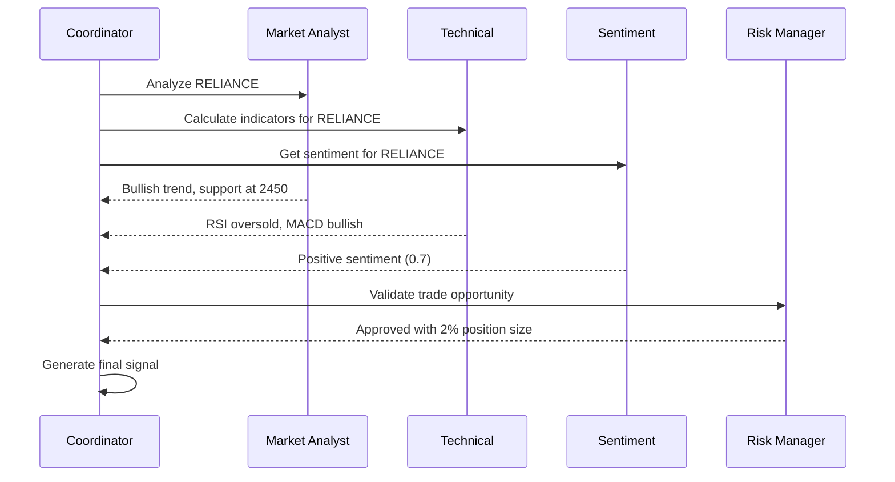

# Shagun Intelligence Agent Architecture & Workflows

## Overview

Shagun Intelligence employs a sophisticated multi-agent system built on the CrewAI framework. Each agent is specialized for specific tasks and collaborates with others to make intelligent trading decisions.

## Agent Hierarchy

```
┌─────────────────────────────────────────────────────┐
│                 Coordinator Agent                   │
│            (Orchestrates all agents)                │
└──────────────────────┬──────────────────────────────┘
                       │
        ┌──────────────┴──────────────┐
        │                             │
┌───────▼──────┐              ┌──────▼───────┐
│ Analysis     │              │ Execution    │
│ Agents       │              │ Agents       │
├──────────────┤              ├──────────────┤
│ • Market     │              │ • Risk       │
│ • Technical  │              │ • Trade      │
│ • Sentiment  │              │ • Data       │
└──────────────┘              └──────────────┘
```

## Individual Agent Details

### 1. Coordinator Agent

**Role**: Master orchestrator that coordinates all other agents and makes final decisions.

**Responsibilities**:
- Aggregate insights from all agents
- Resolve conflicts between agent recommendations
- Prioritize trading opportunities
- Manage resource allocation
- Ensure system coherence

**Key Methods**:
```python
class CoordinatorAgent(Agent):
    def analyze_market(self, symbols: List[str]) -> List[TradingOpportunity]:
        """Orchestrate market analysis across all agents"""
        
    def make_trading_decisions(self) -> List[TradeDecision]:
        """Make final trading decisions based on all inputs"""
        
    def manage_portfolio_risk(self) -> RiskAssessment:
        """Coordinate portfolio-wide risk management"""
```

**Decision Flow**:
```
1. Receive market update
2. Dispatch analysis tasks to specialized agents
3. Collect and validate agent responses
4. Apply decision fusion algorithm
5. Validate with risk manager
6. Execute approved trades
```

### 2. Market Analyst Agent

**Role**: Analyzes overall market conditions, trends, and patterns.

**Responsibilities**:
- Identify market trends (bullish/bearish/sideways)
- Detect chart patterns (head & shoulders, triangles, etc.)
- Calculate support and resistance levels
- Analyze market breadth and momentum
- Multi-timeframe analysis

**Tools & Techniques**:
- Price action analysis
- Volume profile analysis
- Market structure analysis
- Fibonacci retracements
- Elliott Wave theory (basic)

**Output Schema**:
```json
{
  "market_condition": "bullish",
  "trend_strength": 0.85,
  "key_levels": {
    "support": [2450, 2400, 2350],
    "resistance": [2550, 2600, 2650]
  },
  "patterns": [
    {
      "name": "ascending_triangle",
      "confidence": 0.75,
      "target": 2650
    }
  ],
  "recommendation": "long_bias"
}
```

### 3. Technical Indicator Agent

**Role**: Calculates and interprets technical indicators for trading signals.

**Responsibilities**:
- Calculate momentum indicators (RSI, Stochastic, Williams %R)
- Compute trend indicators (Moving Averages, MACD, ADX)
- Analyze volatility indicators (Bollinger Bands, ATR, Keltner Channels)
- Generate indicator-based signals
- Detect divergences

**Indicator Categories**:

| Category | Indicators | Usage |
|----------|------------|-------|
| Momentum | RSI, Stochastic, CCI | Overbought/Oversold conditions |
| Trend | SMA, EMA, MACD | Trend direction and strength |
| Volatility | Bollinger Bands, ATR | Range and breakout detection |
| Volume | OBV, Volume SMA | Confirmation signals |

**Signal Generation**:
```python
def generate_signals(self, data: pd.DataFrame) -> TechnicalSignals:
    signals = {
        'rsi': self._rsi_signal(data),
        'macd': self._macd_signal(data),
        'bb': self._bollinger_signal(data),
        'volume': self._volume_signal(data)
    }
    
    return self._combine_signals(signals)
```

### 4. Sentiment Analyst Agent

**Role**: Analyzes market sentiment from various sources.

**Responsibilities**:
- Process news headlines and articles
- Analyze social media sentiment
- Track institutional activity
- Monitor options flow
- Gauge retail sentiment

**Data Sources**:
- News APIs (financial news)
- Social media APIs (Twitter/Reddit)
- Options data
- Put/Call ratios
- VIX and other sentiment indicators

**Sentiment Scoring**:
```python
class SentimentScore:
    overall: float  # -1 to 1 (-1 = bearish, 1 = bullish)
    confidence: float  # 0 to 1
    components: Dict[str, float]  # Individual source scores
    signals: List[str]  # Key sentiment signals
```

### 5. Risk Manager Agent

**Role**: Manages portfolio risk and validates trading decisions.

**Responsibilities**:
- Calculate position sizes
- Set stop-loss and take-profit levels
- Monitor portfolio exposure
- Enforce risk limits
- Detect anomalies and circuit breakers

**Risk Parameters**:
```yaml
risk_config:
  max_position_size: 0.1  # 10% of portfolio
  max_portfolio_risk: 0.2  # 20% total risk
  max_correlation: 0.7     # Between positions
  max_daily_loss: 0.05     # 5% daily loss limit
  position_sizing:
    method: "kelly_criterion"
    confidence_adjustment: true
    volatility_scaling: true
```

**Risk Checks**:
1. **Pre-trade Validation**
   - Position size limits
   - Correlation with existing positions
   - Available margin check
   - Daily loss limit check

2. **Real-time Monitoring**
   - Stop-loss tracking
   - Profit target monitoring
   - Portfolio heat map
   - Drawdown alerts

### 6. Trade Executor Agent

**Role**: Executes trades and manages orders.

**Responsibilities**:
- Place market/limit orders
- Manage order lifecycle
- Handle partial fills
- Implement smart order routing
- Monitor execution quality

**Execution Strategies**:
```python
class ExecutionStrategy:
    AGGRESSIVE = "market_order"
    PASSIVE = "limit_order"
    ICEBERG = "split_order"
    TWAP = "time_weighted"
    VWAP = "volume_weighted"
```

**Order Management**:
```python
async def execute_trade(self, signal: TradeSignal) -> ExecutionResult:
    # 1. Validate signal
    if not self._validate_signal(signal):
        return ExecutionResult(success=False, reason="Invalid signal")
    
    # 2. Choose execution strategy
    strategy = self._select_strategy(signal)
    
    # 3. Place order
    order = await self._place_order(signal, strategy)
    
    # 4. Monitor execution
    result = await self._monitor_execution(order)
    
    return result
```

### 7. Data Processor Agent

**Role**: Handles all data ingestion, processing, and distribution.

**Responsibilities**:
- Collect real-time market data
- Process and clean data
- Calculate derived metrics
- Maintain data consistency
- Distribute data to other agents

**Data Pipeline**:
```
Market Data → Validation → Cleaning → Enhancement → Distribution
     ↓            ↓           ↓            ↓            ↓
  WebSocket    Schema    Outliers    Indicators    Pub/Sub
```

## Agent Communication

### Communication Patterns

1. **Request-Response**
   - Coordinator requests analysis from specialized agents
   - Agents respond with structured results

2. **Publish-Subscribe**
   - Data processor publishes market updates
   - Agents subscribe to relevant data streams

3. **Event-Driven**
   - Trade execution triggers risk updates
   - Market events trigger analysis cascade

### Shared Memory Architecture

```python
class SharedMemory:
    market_data: Dict[str, MarketData]
    agent_states: Dict[str, AgentState]
    trading_signals: Queue[TradeSignal]
    risk_metrics: RiskMetrics
    execution_queue: Queue[Order]
```

## Workflow Examples

### 1. Market Analysis Workflow



### 2. Trade Execution Workflow

```python
async def trading_workflow(symbol: str):
    # 1. Coordinator initiates analysis
    coordinator = CoordinatorAgent()
    opportunity = await coordinator.analyze_market([symbol])
    
    # 2. Risk validation
    if opportunity.confidence > 0.7:
        risk_assessment = await risk_manager.evaluate(opportunity)
        
        # 3. Position sizing
        if risk_assessment.approved:
            position_size = risk_manager.calculate_position_size(
                opportunity,
                portfolio_value=1000000
            )
            
            # 4. Trade execution
            trade_signal = TradeSignal(
                symbol=symbol,
                action="BUY",
                quantity=position_size,
                entry_price=opportunity.entry_price,
                stop_loss=opportunity.stop_loss,
                take_profit=opportunity.take_profit
            )
            
            result = await trade_executor.execute(trade_signal)
            
            # 5. Post-trade monitoring
            if result.success:
                await trade_executor.monitor_position(result.order_id)
```

### 3. Risk Management Workflow

```python
class RiskManagementWorkflow:
    async def continuous_monitoring(self):
        while self.active:
            # 1. Portfolio assessment
            portfolio_risk = await self.calculate_portfolio_risk()
            
            # 2. Position monitoring
            for position in self.active_positions:
                position_risk = await self.assess_position_risk(position)
                
                # 3. Stop-loss management
                if position_risk.trailing_stop_needed:
                    await self.update_trailing_stop(position)
                
                # 4. Risk limit checks
                if position_risk.limit_breached:
                    await self.execute_risk_action(position)
            
            # 5. Circuit breaker checks
            if portfolio_risk.circuit_breaker_triggered:
                await self.halt_trading()
            
            await asyncio.sleep(1)  # Check every second
```

## Agent Configuration

### Configuration File Structure

```yaml
agents:
  coordinator:
    enabled: true
    decision_threshold: 0.7
    max_concurrent_analyses: 5
    
  market_analyst:
    enabled: true
    timeframes: ["5m", "15m", "1h", "1d"]
    pattern_detection: true
    min_pattern_confidence: 0.6
    
  technical_indicator:
    enabled: true
    indicators:
      momentum: ["rsi", "stochastic", "cci"]
      trend: ["sma", "ema", "macd"]
      volatility: ["bb", "atr", "keltner"]
      volume: ["obv", "vwap"]
    signal_weights:
      rsi: 0.2
      macd: 0.3
      bb: 0.2
      volume: 0.3
      
  sentiment_analyst:
    enabled: true
    sources:
      news: true
      social_media: true
      options_flow: false
    update_frequency: 300  # seconds
    
  risk_manager:
    enabled: true
    max_position_size: 100000
    max_portfolio_risk: 0.2
    stop_loss_method: "atr"
    position_sizing: "kelly"
    
  trade_executor:
    enabled: true
    execution_strategy: "smart"
    slippage_tolerance: 0.001
    max_retry_attempts: 3
    
  data_processor:
    enabled: true
    websocket_reconnect: true
    data_validation: true
    cache_duration: 300
```

## Performance Optimization

### 1. Parallel Processing
```python
async def parallel_analysis(symbols: List[str]):
    tasks = []
    for symbol in symbols:
        task = asyncio.create_task(analyze_symbol(symbol))
        tasks.append(task)
    
    results = await asyncio.gather(*tasks)
    return results
```

### 2. Caching Strategy
- Cache technical indicators for 1 minute
- Cache sentiment scores for 5 minutes
- Cache market structure for 15 minutes

### 3. Resource Management
- Limit concurrent analyses to prevent overload
- Implement request queuing
- Use connection pooling for external APIs

## Monitoring & Debugging

### Agent Metrics
```python
class AgentMetrics:
    execution_time: float
    success_rate: float
    error_count: int
    last_error: Optional[str]
    memory_usage: float
    cpu_usage: float
```

### Logging
```python
# Agent-specific loggers
market_analyst_logger = logging.getLogger("agents.market_analyst")
risk_manager_logger = logging.getLogger("agents.risk_manager")

# Log analysis results
market_analyst_logger.info(f"Analysis complete for {symbol}: {result}")
```

### Health Checks
```python
async def agent_health_check():
    health_status = {}
    
    for agent_name, agent in agents.items():
        try:
            status = await agent.health_check()
            health_status[agent_name] = {
                "status": "healthy",
                "last_execution": status.last_execution,
                "error_rate": status.error_rate
            }
        except Exception as e:
            health_status[agent_name] = {
                "status": "unhealthy",
                "error": str(e)
            }
    
    return health_status
```

## Best Practices

1. **Agent Independence**
   - Each agent should be able to function independently
   - Graceful degradation if an agent fails
   - No hard dependencies between agents

2. **Data Consistency**
   - Use centralized data store
   - Implement versioning for shared data
   - Atomic updates for critical data

3. **Error Handling**
   - Implement circuit breakers
   - Exponential backoff for retries
   - Comprehensive error logging

4. **Testing**
   - Unit tests for each agent
   - Integration tests for workflows
   - Performance benchmarks

5. **Scalability**
   - Horizontal scaling for analysis agents
   - Vertical scaling for data processor
   - Load balancing for requests