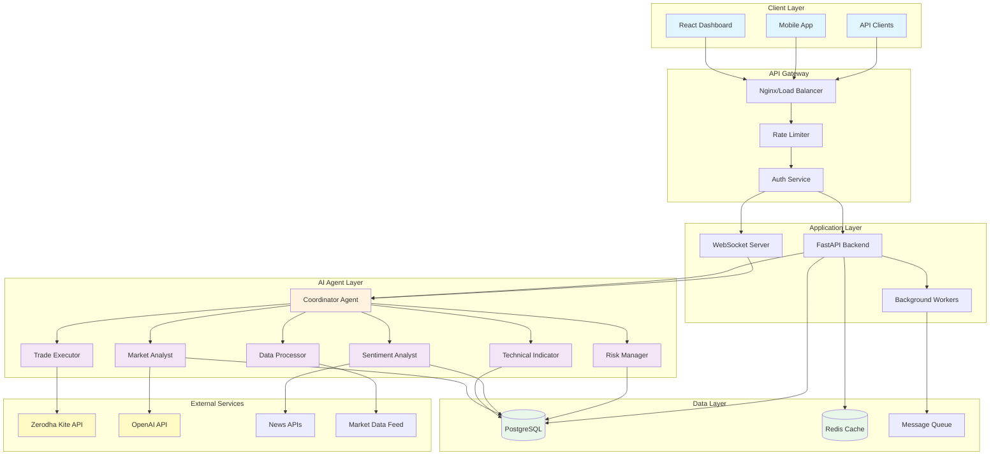
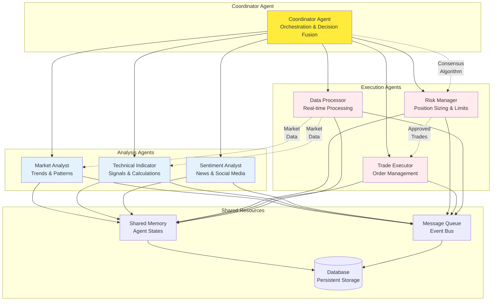
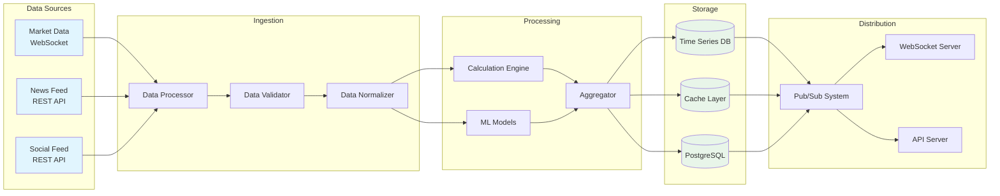
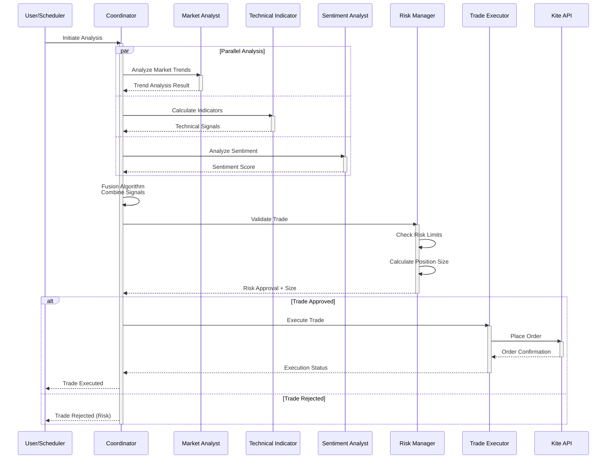
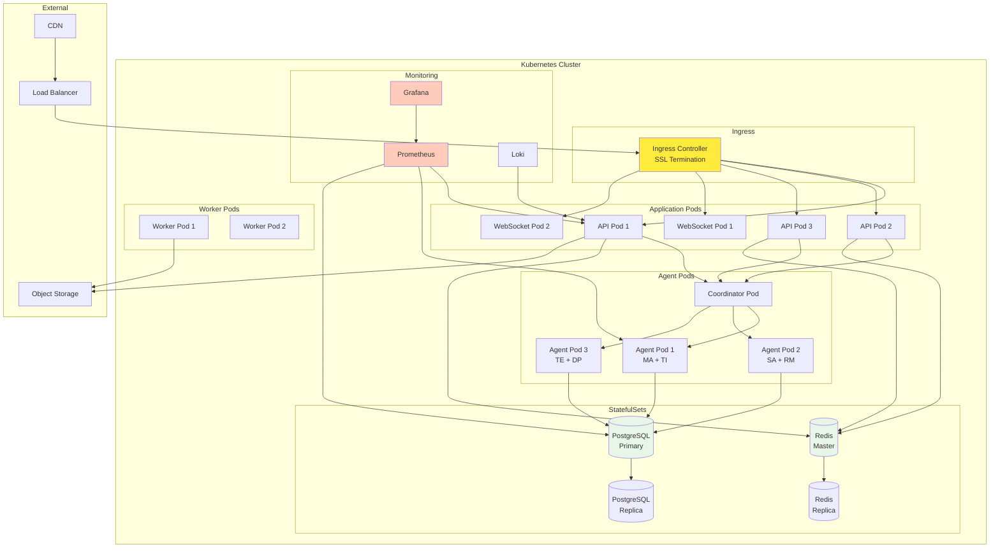
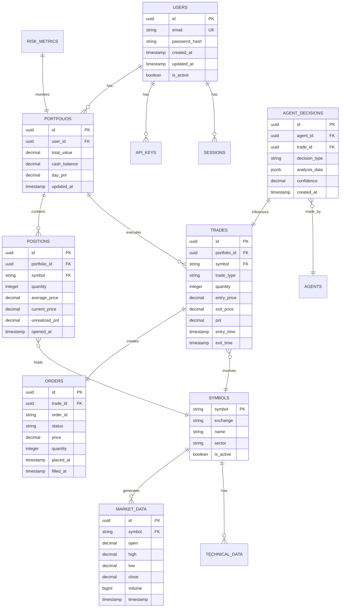
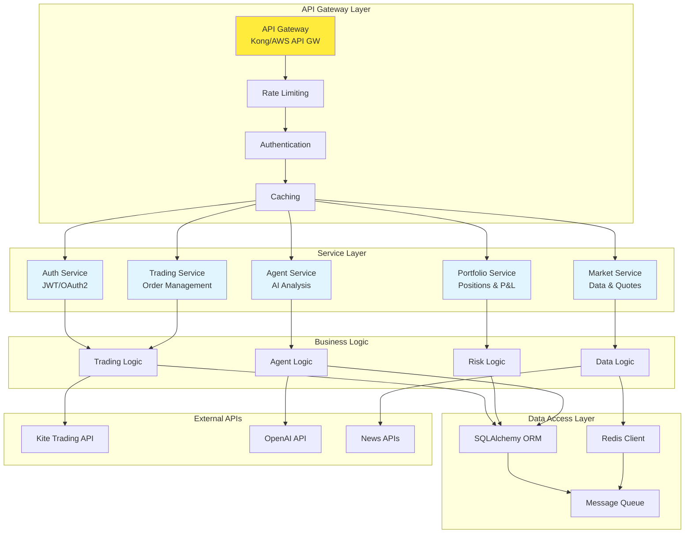
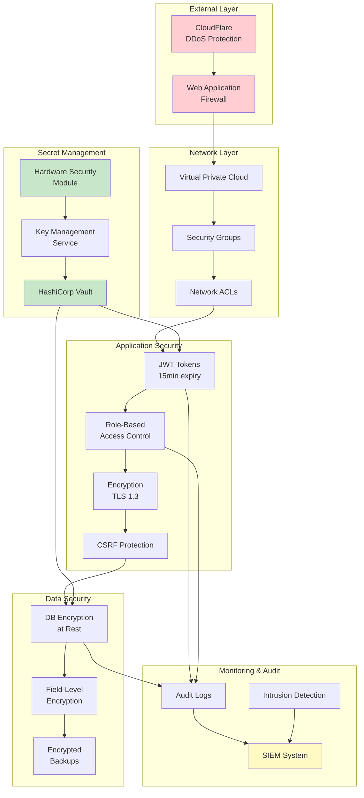
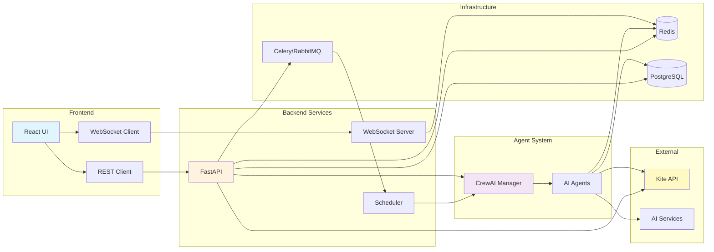
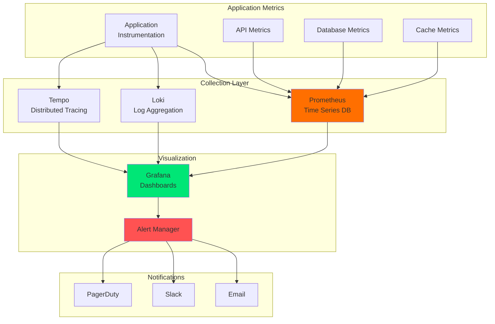

# Shagun Intelligence Architecture Diagrams

This document contains comprehensive architecture diagrams for the Shagun Intelligence platform using Mermaid syntax. These diagrams can be rendered in any Markdown viewer that supports Mermaid.

## Table of Contents

1. [System Overview](#system-overview)
2. [Multi-Agent Architecture](#multi-agent-architecture)
3. [Data Flow Diagram](#data-flow-diagram)
4. [Trading Workflow](#trading-workflow)
5. [Deployment Architecture](#deployment-architecture)
6. [Database Schema](#database-schema)
7. [API Architecture](#api-architecture)
8. [Security Architecture](#security-architecture)

## System Overview

## Multi-Agent Architecture

## Data Flow Diagram

## Trading Workflow

## Deployment Architecture

## Database Schema

## API Architecture

## Security Architecture

## Component Interaction Diagram

## Monitoring Architecture

---

## How to Use These Diagrams

1. **Viewing**: These diagrams can be viewed in:
   - GitHub (automatic rendering)
   - VS Code with Mermaid extension
   - Online Mermaid editors
   - Any Markdown viewer with Mermaid support

2. **Exporting**: To export as images:
   - Use Mermaid CLI: `mmdc -i diagram.mmd -o diagram.png`
   - Use online tools like mermaid.live
   - Screenshot from rendered view

3. **Customizing**: 
   - Colors can be changed in the `style` declarations
   - Add more nodes by following the existing patterns
   - Modify relationships by changing arrow types

4. **Integration**: 
   - Include in documentation
   - Use in presentations
   - Add to README files
   - Embed in wiki pages

These diagrams provide a comprehensive visual representation of the Shagun Intelligence architecture and can be updated as the system evolves.