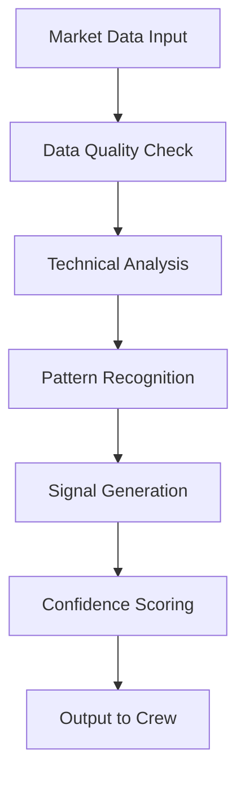
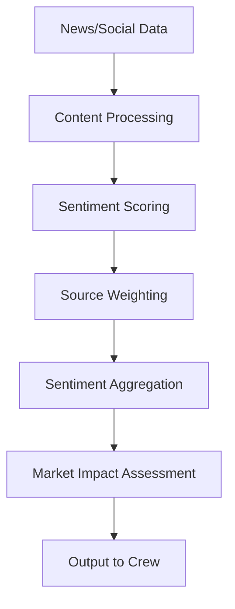
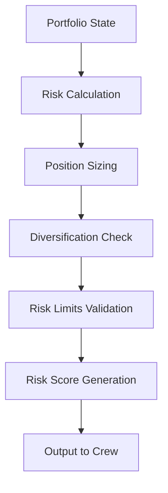
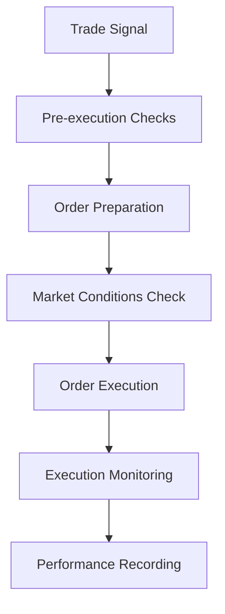

# Shagun Intelligence Agent Architecture & Workflows

## Overview

Shagun Intelligence employs a sophisticated multi-agent system built on the CrewAI framework. Each agent is specialized for specific tasks and collaborates with others to make intelligent trading decisions.

## Agent Hierarchy

```
┌─────────────────────────────────────────────────────┐
│                 Crew Manager                        │
│            (Orchestrates all agents)                │
└─────────────────┬───────────────────────────────────┘
                  │
    ┌─────────────┼─────────────┐
    │             │             │
┌───▼───┐    ┌───▼───┐    ┌───▼───┐
│Market │    │Sentiment│   │Risk   │
│Analyst│    │Analyst │    │Manager│
└───┬───┘    └───┬───┘    └───┬───┘
    │            │            │
    └─────────┬──┴────────────┘
              │
         ┌───▼───┐
         │Trade  │
         │Executor│
         └───────┘
```

## Core Agents

### 1. Market Analyst Agent

**Role**: Technical analysis and market data interpretation
**Responsibilities**:

- Real-time technical indicator calculation
- Chart pattern recognition
- Price trend analysis
- Volume analysis
- Support/resistance level identification

**Key Features**:

- Quality-aware data processing
- Multi-timeframe analysis
- Advanced indicator calculations (RSI, MACD, Bollinger Bands, etc.)
- Market regime detection

### 2. Sentiment Analyst Agent

**Role**: News and social media sentiment analysis
**Responsibilities**:

- News article sentiment scoring
- Social media monitoring
- Market sentiment aggregation
- Event impact assessment

**Key Features**:

- Multi-source sentiment fusion
- Real-time news processing
- Social media trend analysis
- Sentiment-based market timing

### 3. Risk Manager Agent

**Role**: Portfolio risk assessment and position sizing
**Responsibilities**:

- Position size calculation
- Risk-reward ratio analysis
- Portfolio diversification monitoring
- Stop-loss and take-profit optimization

**Key Features**:

- Dynamic position sizing
- Multi-factor risk assessment
- Real-time portfolio monitoring
- Emergency risk controls

### 4. Trade Executor Agent

**Role**: Order execution and trade management
**Responsibilities**:

- Order placement and management
- Trade execution optimization
- Position monitoring
- Performance tracking

**Key Features**:

- Smart order routing
- Execution quality monitoring
- Real-time position tracking
- Trade performance analysis

## Agent Workflows

### 1. Market Analysis Workflow



### 2. Sentiment Analysis Workflow



### 3. Risk Assessment Workflow



### 4. Trade Execution Workflow



## Inter-Agent Communication

### Data Flow

1. **Market Analyst** → Technical signals and market conditions
2. **Sentiment Analyst** → Sentiment scores and market mood
3. **Risk Manager** → Risk assessment and position sizing
4. **Trade Executor** → Execution feedback and performance data

### Decision Making Process

1. **Data Collection**: Each agent gathers and processes its specialized data
2. **Analysis**: Agents perform their specific analysis tasks
3. **Collaboration**: Agents share insights through the Crew Manager
4. **Consensus Building**: Crew Manager aggregates agent outputs
5. **Decision**: Final trading decision based on multi-agent consensus
6. **Execution**: Trade Executor implements the decision
7. **Monitoring**: Continuous monitoring and feedback loop

## Quality-Aware Processing

### Data Quality Levels

- **HIGH**: Real-time, verified data from primary sources
- **MEDIUM**: Slightly delayed or secondary source data
- **LOW**: Cached, estimated, or unreliable data

### Quality-Based Decision Making

- **HIGH Quality**: Full automated trading enabled
- **MEDIUM Quality**: Conservative trading with reduced position sizes
- **LOW Quality**: Trading disabled, monitoring mode only

## Agent Configuration

### Market Analyst Configuration

```python
market_analyst_config = {
    "indicators": ["RSI", "MACD", "BB", "SMA", "EMA"],
    "timeframes": ["1m", "5m", "15m", "1h", "1d"],
    "quality_threshold": 0.8,
    "confidence_threshold": 0.7
}
```

### Sentiment Analyst Configuration

```python
sentiment_analyst_config = {
    "sources": ["news", "twitter", "reddit"],
    "sentiment_threshold": 0.6,
    "source_weights": {"news": 0.5, "twitter": 0.3, "reddit": 0.2},
    "update_frequency": 300  # seconds
}
```

### Risk Manager Configuration

```python
risk_manager_config = {
    "max_position_size": 0.05,  # 5% of portfolio
    "max_daily_loss": 0.02,     # 2% daily loss limit
    "diversification_limit": 0.3, # Max 30% in single sector
    "stop_loss_percentage": 0.02   # 2% stop loss
}
```

## Performance Monitoring

### Agent Metrics

- **Accuracy**: Percentage of correct predictions
- **Precision**: True positives / (True positives + False positives)
- **Recall**: True positives / (True positives + False negatives)
- **Response Time**: Time taken for analysis
- **Data Quality Score**: Average quality of processed data

### System Metrics

- **Overall Success Rate**: Percentage of profitable trades
- **Risk-Adjusted Returns**: Sharpe ratio and other risk metrics
- **System Uptime**: Availability and reliability metrics
- **Processing Latency**: End-to-end decision making time

## Error Handling and Recovery

### Agent-Level Error Handling

- **Data Validation**: Input data quality checks
- **Fallback Mechanisms**: Alternative data sources and methods
- **Graceful Degradation**: Reduced functionality during errors
- **Automatic Recovery**: Self-healing capabilities

### System-Level Error Handling

- **Circuit Breakers**: Automatic system shutdown on critical errors
- **Health Monitoring**: Continuous agent health checks
- **Alerting**: Real-time error notifications
- **Backup Systems**: Redundant processing capabilities

## Future Enhancements

### Planned Improvements

1. **Machine Learning Integration**: Advanced ML models for pattern recognition
2. **Multi-Market Support**: Extension to multiple asset classes
3. **Advanced Risk Models**: More sophisticated risk assessment
4. **Real-Time Optimization**: Dynamic parameter adjustment
5. **Explainable AI**: Better decision transparency

### Scalability Considerations

- **Horizontal Scaling**: Multi-instance agent deployment
- **Load Balancing**: Distributed processing capabilities
- **Caching Strategies**: Optimized data storage and retrieval
- **Resource Management**: Efficient CPU and memory usage

---

This architecture provides a robust, scalable, and intelligent trading system that can adapt to changing market conditions while maintaining strict risk controls and high-quality decision making.
